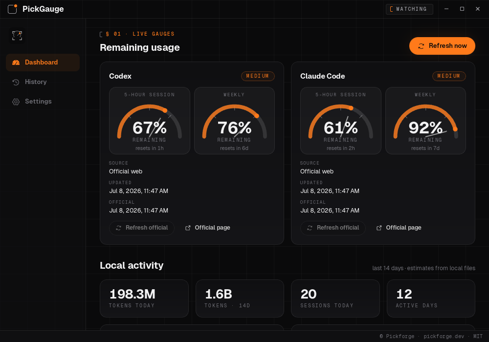
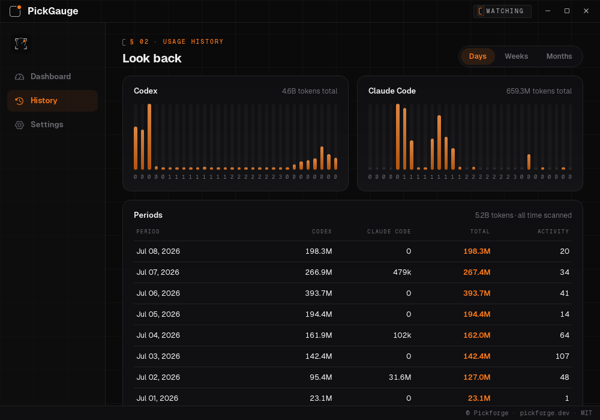
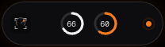

<p align="center">
  
</p>

# PickGauge

A fuel gauge for your AI subscriptions. PickGauge is a privacy-conscious Linux tray app that tracks remaining Codex and Claude Code usage plus the active Grok plan — keeping quota awareness visible without storing passwords, uploading account data, or pretending best-effort estimates are exact.

PickForge builds the app. PickGauge tells you how much agent fuel is left while you do it.

Local-first. Open source. Built for people who ship.

> **Status:** Tauri/Svelte desktop app with a branded dashboard, usage history, floating button, sound cues, persisted settings, tray wiring, app icons, and release automation. Web providers remain opt-in and await authenticated validation.

## Install

**Quick install** (Linux AppImage with FUSE fallback, no sudo):

```sh
curl -fsSL https://pickforge.dev/pickgauge/install.sh | sh
```

Pulls the latest [release](https://github.com/pickforge/pickgauge/releases) AppImage into your home, adds an app-menu launcher, and falls back automatically on FUSE3-only systems. macOS `.app` bundles install the same way; Windows and macOS builds are still **untested**.

Release artifacts are built from `main` by GitHub Actions: Linux AppImage, Windows installers, macOS Intel and Apple Silicon builds. Download the latest from [Releases](https://github.com/pickforge/pickgauge/releases/latest). PickGauge is still **Linux/KDE-first** — Linux is the tested platform; the Windows and macOS builds are produced automatically but currently **untested**; experience reports are welcome.

On CachyOS/Arch-like systems, local AppImage bundling can fail because the linuxdeploy `strip` binary does not understand newer `.relr.dyn` ELF sections. Use the project script, which disables linuxdeploy stripping:

```bash
bun run build:appimage
```

The AppImage script also prepares the Linux Playwright sidecar executable under `src-tauri/binaries/` before invoking Tauri. Real headed web-provider login still requires a working local Node/Playwright runtime. For local sidecar launch validation:

```bash
bunx playwright install chromium
bun run test:sidecar-launch
```

## The desktop app

PickGauge ships a full Tauri 2 + Svelte 5 GUI in the Pickforge "one ember on a cold canvas" design system:

- **Dashboard** — half-arc gauges per service with confidence, source, and freshness labels, plus local activity stats and a 14-day token chart.
- **History** — local Codex and Claude Code usage grouped by **days, weeks, or months** (scanned from local activity files, up to a year back), with per-period totals and a gauge trail of the lowest remaining percentage per day (stored in a local SQLite history at `~/.local/share/com.pickforge.pickgauge/history.db`).
- **Floating button** — a draggable always-on-top capsule with live mini-gauges. Click it to open the app, right-click to refresh. It never takes keyboard focus. On Wayland the app runs under XWayland so always-on-top works (set `PICKGAUGE_NATIVE_WAYLAND=1` to opt out).
- **Sounds, not notifications** — short synthesized chimes when a gauge crosses below the low-usage threshold and when it recovers (toggle in Settings). PickGauge never posts desktop notifications.
- **Settings** — services, providers, refresh rhythm, quota calibration, browser profiles, autostart, sounds, and the floating button, all persisted locally.

## Screenshots

Real captures of the app in its studio chrome (frameless bracket titlebar, unified status bar).

<p align="center">
  
</p>

<p align="center">
  
  <br>
  
</p>

<p align="center">
  
</p>

## What it will do

- Show Codex and Claude Code usage plus the active Grok plan from a KDE/Linux system tray icon.
- Alternate the tray gauge between services on a configurable interval.
- Open a compact popup with remaining percentage, source, confidence, and last update time.
- Persist basic provider/service settings locally.
- Combine local CLI usage estimates with optional official-page readings.
- Clearly label data as `high`, `medium`, `low`, or `unknown` confidence.
- Fail gracefully when local files are missing, login expires, MFA appears, or official pages change.

Planned services:

| Service | Source | Confidence |
| --- | --- | --- |
| Codex | Local CLI/session data and optional official analytics page | Low to high |
| Claude Code | Local JSONL/status data and optional official usage page | Low to high |
| Grok | Local CLI subscription plan and billing-period end | Medium |

Official usage pages:

- Codex: <https://chatgpt.com/codex/cloud/settings/analytics>
- Claude Code: <https://claude.ai/new#settings/usage>

## Security / Privacy

PickGauge reads how much quota you have left without ever holding your account.

- **No passwords, ever.** PickGauge never asks for, sees, or stores provider passwords. For its default readings it reuses the OAuth tokens the Codex, Claude Code, and Grok CLIs already wrote to disk (`~/.codex/auth.json`, `~/.claude/.credentials.json`, `~/.grok/auth.json`).
- **Tokens stay in memory.** Tokens are read at refresh time and never copied into PickGauge's config, on-disk cache, logs, or local history. Grok's bearer is read-only: PickGauge never refreshes, stores, or writes it; sign in with the Grok CLI again when it expires.
- **Usage requests stay provider-only.** To compute real remaining quota or detect a plan, PickGauge calls the same official endpoints the CLIs use — `chatgpt.com/backend-api/codex/usage`, `api.anthropic.com/api/oauth/usage`, and one authenticated `GET grok.com/rest/subscriptions`. Grok never makes an OAuth refresh request. No usage measurements, project files, account data, tokens, or provider responses are sent to Pickforge or third-party analytics services.
- **Anonymous crash reports.** Crash and error reporting is on by default in release builds and can be turned off in Settings → Crash reports. Reports go to Sentry with crash stack traces, OS version, and app version. Native crash dumps include a snapshot of process memory, which may contain fragments of recent in-memory data. Reports never intentionally include usage measurements, project files, or personal data; the hostname is stripped. Crash reporting is disabled in development builds unless `PICKGAUGE_SENTRY_DEBUG=1` is set.
- **Web reads are opt-in and isolated.** Browser-based reading of the official usage pages is disabled by default. When enabled, it runs only in dedicated, app-owned browser profiles (under `com.pickforge.pickgauge`) that you log into yourself — never your personal browser, never a shared cookie jar.
- **Ollama plan reads use your local daemon.** When Ollama is enabled, PickGauge sends a read-only request only to the local daemon at `http://localhost:11434/api/me` and never contacts ollama.com itself. The daemon resolves the account with ollama.com using its own credentials. PickGauge retains only the returned plan name; account IDs, email addresses, names, and avatars are never stored, logged, or included in snapshots.
- **Data minimization.** No raw page HTML, auth headers, cookies, tokens, or account identifiers are written to PickGauge logs, fixtures, or its local SQLite history — only computed percentages, confidence, source, and timestamps.
- **Honest confidence.** Every reading is labeled official, estimated, merged, stale, or unavailable, so you always know how much to trust the number.

## Architecture

```text
Tray controller
├─ Dynamic gauge icon
├─ Compact popup
└─ Settings actions

Usage engine
├─ Codex local provider
├─ Claude local provider
├─ Grok CLI plan provider
├─ Optional Codex web provider
├─ Optional Claude web provider
└─ Merger and confidence model

Privacy boundary
├─ Dedicated browser profiles
├─ Sanitized provider results
└─ Guarded cache/session cleanup
```

Stack: **Rust** for the backend, usage engine, tray control, config, and provider logic; **Tauri v2** for the lightweight desktop shell and tray integration; **Svelte** for the popup and settings UI; **KDE/Wayland first**, with CachyOS Linux as the target validation environment.

PickGauge needs a real desktop shell: a persistent tray icon, native windows, local filesystem access for CLI usage data, isolated browser/session handling, and packaged installers. Tauri gives the app a Rust backend for the privacy-sensitive work while keeping the popup/settings UI lightweight with Svelte instead of shipping a full Electron runtime.

## Branding

Brand assets live in `assets/branding/`. The app uses the Pickforge Studio v2 dark/ember system:

- `pickgauge-mark-128.svg` and `pickgauge-lockup-on-dark.svg` in the popup UI.
- `pickgauge-brand-pattern.svg` and `pickgauge-hero-art.png` for the app surface.
- `pickgauge-app-icon.svg` for generated Tauri app icons.
- `pickgauge-tray-codex-64.png`, `pickgauge-tray-claude-64.png`, `pickgauge-tray-low-64.png`, and `pickgauge-tray-unknown-64.png` for tray states.

After changing the source app icon, regenerate platform icons with:

```bash
bun run tauri icon assets/branding/pickgauge-app-icon.svg
```

## Roadmap

1. Bootstrap the Tauri + Svelte app shell.
2. Validate KDE/Wayland tray and popup behavior.
3. Render alternating branded Codex/Claude tray icons.
4. Add persistent settings and provider toggles.
5. Build local usage providers.
6. Spike browser automation for official-page reads.
7. Add opt-in web providers with isolated sessions.
8. Merge official baselines with local usage deltas.
9. Packaged releases exist for Linux, Windows, and macOS; validate the macOS and Windows builds on native hosts.

Project documents: [`docs/plans/pickgauge-implementation-plan.md`](docs/plans/pickgauge-implementation-plan.md) — consolidated product spec, implementation plan, validation gates, and security checklist.

## Development

```bash
bun install              # install dependencies
bun run dev              # Vite dev server on 127.0.0.1:1420
bun run build            # build the Svelte front-end
bun run build:appimage   # bundle the Linux AppImage (prepares the Playwright sidecar)
bun run test             # unit tests, sidecar node tests, and sidecar package checks
bun run lint             # ESLint over src, scripts, and sidecars
bun run check            # svelte-check type checking
```

## License

MIT — see [LICENSE](LICENSE).

---

<p align="center">
  <a href="https://pickforge.dev">
    
  </a>
</p>
